# Strata — Architecture and Flow Diagram Library

These Mermaid diagrams are source material. Render them to SVG/PNG before placing them into the PPT; avoid screenshots of code blocks.

---

## 1. Stakeholder context

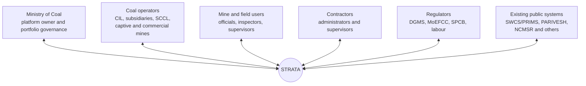

## 2. Product module architecture

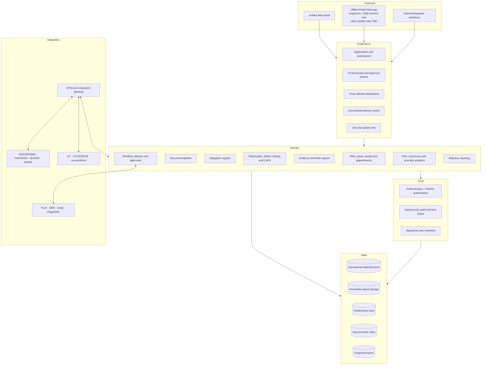

## 3. Prototype deployment view

Technology names are recommended defaults, not irreversible PRD requirements.

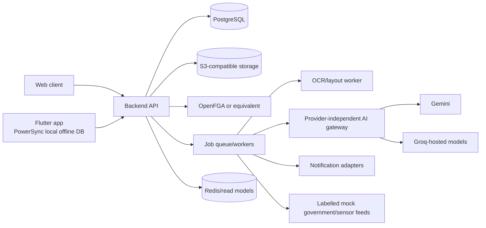

AI provider rules:

- one internal interface and structured schemas;
- approved keys stored server-side only;
- retry with exponential backoff;
- provider fallback for availability, not quota evasion;
- queue when capacity is exhausted;
- redact/minimise sensitive payloads; and
- store prompts/model version/output provenance for review.

## 4. Production logical deployment

```mermaid
flowchart TB
    subgraph Edge
      WAF[WAF/API gateway]
      IDP[Government/enterprise identity]
    end

    subgraph Stateless services
      CORE[Core domain services]
      READ[Dashboard/read service]
      INT[Integration service]
      NOT[Notification service]
      AIG[AI orchestration service]
    end

    subgraph Durable processing
      BUS[Event bus]
      JOB[Background workers]
      OUT[Transactional outbox]
    end

    subgraph Stores
      DB[(HA relational database<br/>tenant RLS)]
      BLOB[(WORM/content-addressed object store)]
      GRAPH[(Authorisation relationship store)]
      IDX[(Search/vector indexes)]
      PROJ[(Read projections/cache)]
    end

    subgraph Operations
      OBS[Logs, metrics and traces]
      KMS[Key and secret management]
      SIEM[Security monitoring]
      DR[Backup and disaster recovery]
    end

    WAF --> CORE
    IDP --> CORE
    CORE --> DB
    CORE --> GRAPH
    CORE --> BLOB
    CORE --> OUT
    OUT --> BUS
    BUS --> JOB
    BUS --> READ
    JOB --> AIG
    JOB --> INT
    JOB --> NOT
    READ --> PROJ
    AIG --> IDX
    Operations --> Stateless services
    Operations --> Durable processing
    Operations --> Stores
```

## 5. Unified portal transition

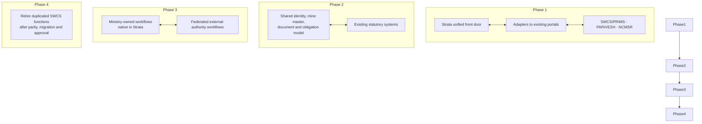

## 6. Document data flow

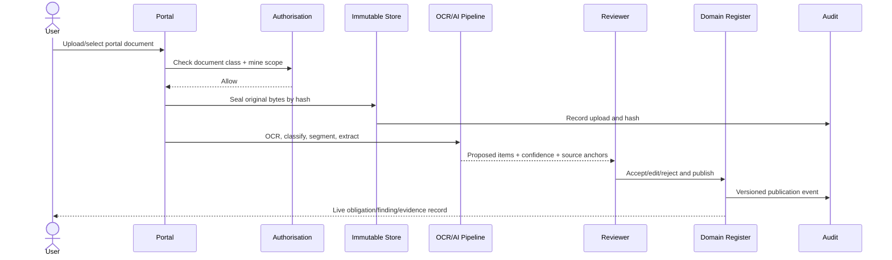

## 7. Obligation lifecycle

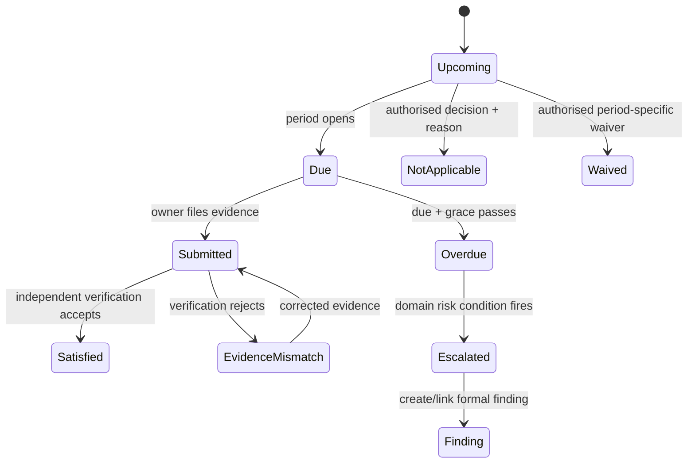

## 8. Inspection assignment and fieldwork

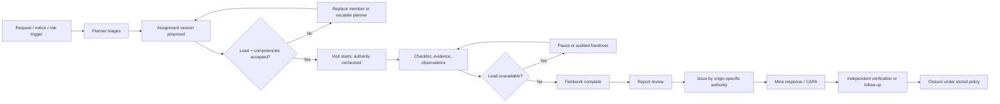

Internal, regulatory, third-party and received-notice inspections differ in who may plan, assign, issue and close. See [`../features/inspections/inspection-spec.md`](../features/inspections/inspection-spec.md).

## 9. Observation-to-closure flow

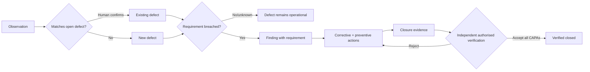

## 10. Offline field sync

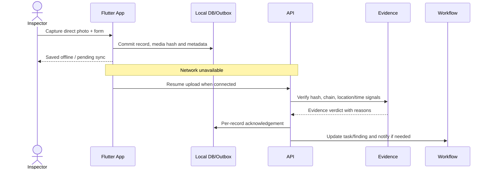

## 11. Recipient resolution and delivery

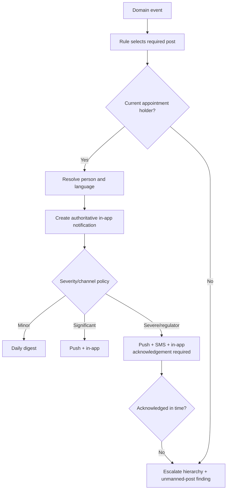

## 12. Dashboard data flow and traceability

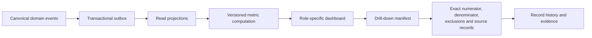

## 13. Authorisation explained visually

Canonical semantics live in [`identity-authority-model.md`](identity-authority-model.md). The cookie/session identifies a principal only; target-resource scope, current appointments, mandates, and jurisdiction are evaluated for every request.

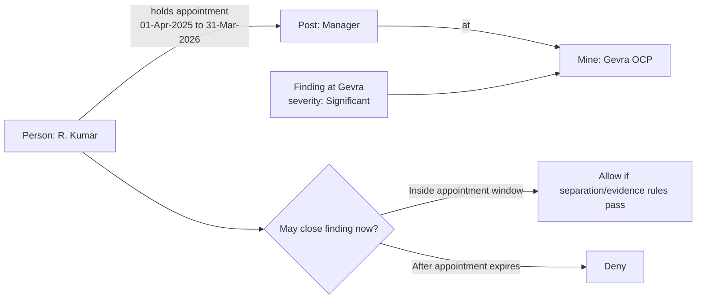

## 14. Multi-tenant hierarchy

The tenant boundary is independent of organisation and mine hierarchy. CIL is one tenant by default, subsidiaries are organisation units, and Ministry/regulator principals use explicit cross-tenant portfolio or jurisdiction assignments. See [`identity-authority-model.md`](identity-authority-model.md) before changing this diagram or its implementation.

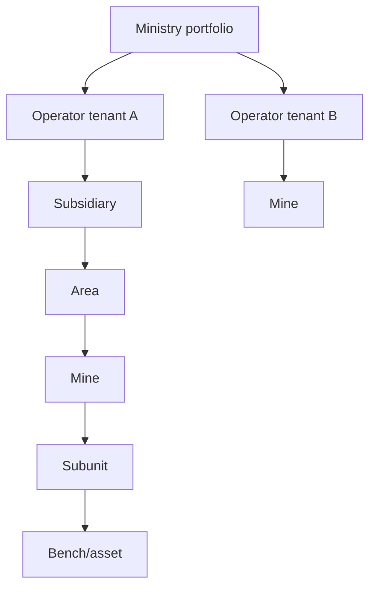

Visibility flows upward only through authorised relationships. Tenant row-level security provides a second barrier against accidental cross-operator leakage.

## 15. Analytics flow

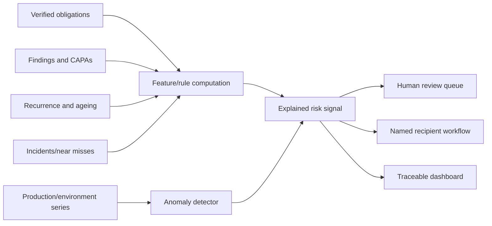
