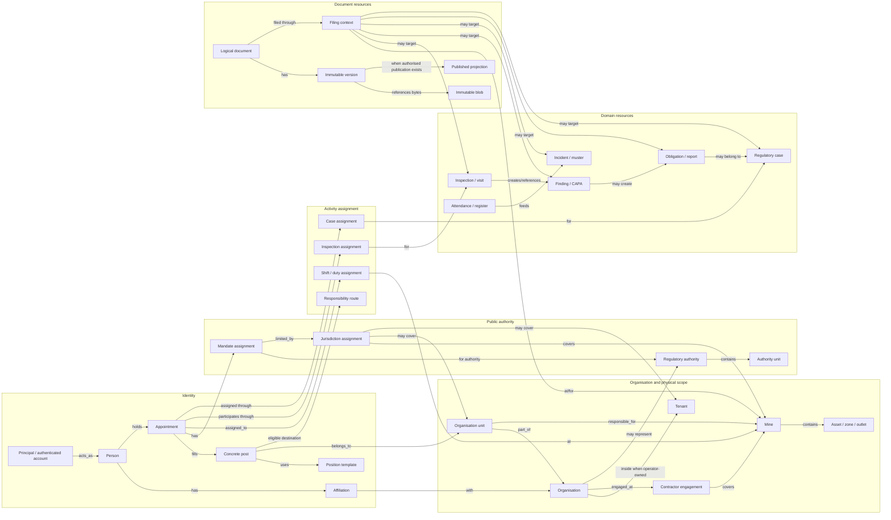
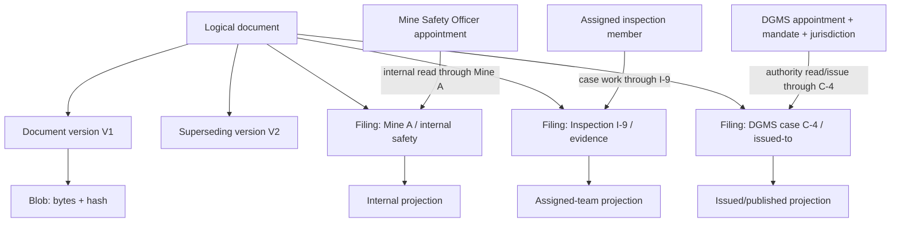
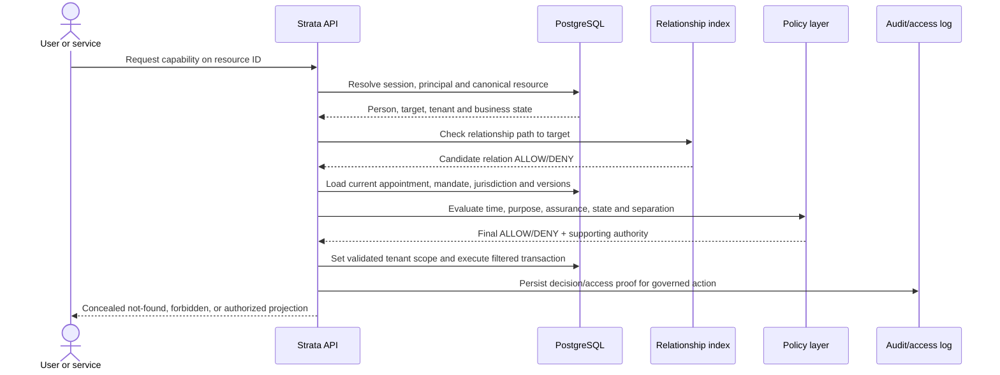
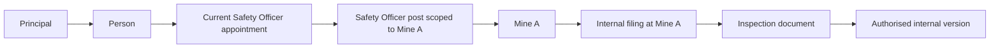
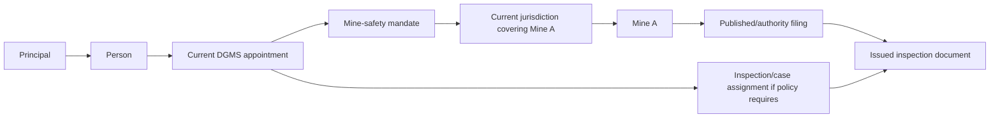

# Strata — ReBAC Role, Resource and Document Graph

## 1. Purpose and authority

This is the visual companion to the [Identity and Authority Model](identity-authority-model.md)
and [Authorization Specification](../features/access-control/authorization-spec.md). Read
it before implementing OpenFGA tuples, document access, role browsing, inherited scope,
authority portfolios or “who can see this?” graph views.

The diagrams explain the model; the identity model and authorization specification remain
canonical. PostgreSQL owns relationships and their history. OpenFGA is a derived access
index, not the appointment or legal-record system of record.

## 2. Short answer: where ReBAC fits

Yes, documents and roles are important ReBAC resources—but Strata does not connect a
generic role directly to document bytes.

```text
principal → person → appointment → post → governed scope
                                          ↓
document → version → filing context → mine / case / inspection / organisation / authority
```

The document is accessible because the person has a valid relationship to an authorised
filing context and the requested capability is allowed. Possessing a URL, blob ID, role
label or broad tenant membership is insufficient.

## 3. Complete relationship graph



Not every possible edge becomes an OpenFGA tuple. Canonical PostgreSQL relationships are
projected into the smallest tuple set needed for authorization traversal.

## 4. People and roles in the graph

A “role” displayed to a human can originate from several graph objects:

| UI concept | Actual graph representation | Example |
|---|---|---|
| Employment/relationship | Affiliation | Contractor worker affiliated with Contractor C |
| Organisational position | Concrete post plus appointment | Person fills Safety Officer post at Mine A |
| Regulatory authority | Authority post + appointment + mandate + jurisdiction | DGMS officer with mining-inspection mandate over Mine A |
| Shift function | Duty assignment | Appointed overman is official in charge for Shift 2 |
| Inspection function | Participation assignment | Same person is lead field examiner on Inspection I-9 |
| Workflow ownership | Responsibility route/task assignment | Current holder of Environment Review post receives escalation |
| App persona | Projection of current work | Inspector/field-worker mobile journey |

These representations must not be collapsed into `user.role = INSPECTOR`.

## 5. Document graph: bytes are not the security boundary



One physical blob may be deduplicated, but that never shares authorization. Access is
checked on the logical document/version and each filing context. The response includes
only filings and fields the requester may see.

### Why filing contexts matter

A document can be:

- internal evidence at one mine;
- attached to an inspection;
- submitted with a statutory report;
- issued by an external authority;
- relevant to several mines; or
- a national instrument with no mine at all.

A single `document.owner_id` or `document.mine_id` cannot represent those relationships
safely. `document_filing` is the governed edge between the document and its applicable
resource, purpose and projection.

## 6. ReBAC, contextual policy and RLS divide the work

| Control | Answers | Examples | Must not be used for |
|---|---|---|---|
| Authentication/session | Who authenticated and at what assurance? | Principal, person, recent MFA | Role or jurisdiction |
| ReBAC/OpenFGA | How is the principal related to the resource? | Holds scoped post, assigned inspection member, contractor engaged at mine | Time-sensitive legal/business state by itself |
| Contextual policy | Is this action allowed under current conditions? | Appointment validity, mandate, jurisdiction, purpose, severity, publication state, conflict, signature assurance | Broad list filtering without resource relationships |
| PostgreSQL/RLS | Which tenant rows can this transaction touch? | Validated `app.tenant_id`, fail-closed tenant filter | Cross-tenant regulator authority by disabling isolation |
| Domain state machine | Is the transition valid? | Issued report can be superseded; CAPA evidence meets closure gate | Identity or scope grant |
| Audit/access history | Can the decision be reconstructed? | Appointment, policy version, effective scope, purpose and time | Granting authority after the fact |

The effective decision is an intersection:

```text
ALLOW = authenticated principal
      ∩ person/relationship path
      ∩ capability on canonical resource
      ∩ current appointment/engagement
      ∩ current mandate and jurisdiction where applicable
      ∩ allowed resource state and projection
      ∩ purpose, assurance and separation policy
      ∩ tenant/resource database enforcement
```

Any missing term produces `DENY`.

## 7. Authorization decision flow



The selected workspace only helps navigation. The target resource is resolved and checked
again on every request.

## 8. Representative access paths

### 8.1 Mine Safety Officer reads an internal inspection document



Required capability: `document.read_internal`. This path does not allow regulatory issue,
regulatory closure or documents at Mine B.

### 8.2 Contractor worker sees assigned material

```text
principal → person
person → current contractor affiliation → Contractor C
Contractor C → current engagement/package → Mine A
person → current roster/task assignment → Package P
document → filing → Package P or permitted task
```

Expired affiliation, engagement or task assignment breaks current access. Historical
access is record-specific and does not restore general mine visibility.

### 8.3 DGMS officer reads an issued inspection record



The read also requires purpose logging and the permitted published/authority projection.
The same person cannot use this path for MoEFCC actions or out-of-jurisdiction Mine B.

### 8.4 Ministry portfolio read

```text
principal → person → current Ministry post/portfolio assignment
portfolio assignment → explicit authorised mine/tenant resource set
document/report/dashboard → filing/projection within that effective set
```

“Ministry” never means unrestricted cross-tenant bypass. Requested and effective scope are
recorded, and results are recomputed from records authorized for that projection.

## 9. Suggested conceptual OpenFGA relations

This is illustrative input to the future executable model, not copy-paste production DSL:

```text
type principal
  relations
    define acts_as: [person]

type person
  relations
    define holds: [appointment]
    define affiliated_with: [organization]

type post
  relations
    define parent_unit: [organization_unit]
    define scoped_mine: [mine]
    define holder: appointment from_post

type mine
  relations
    define owning_tenant: [tenant]
    define responsible_unit: [organization_unit]
    define internal_reader: holder from responsible_unit

type inspection
  relations
    define target: [mine]
    define assigned_member: [principal]
    define authority_unit: [authority_unit]

type document
  relations
    define filing: [document_filing]
    define internal_reader: internal_reader from filing
    define published_reader: published_reader from filing
    define reviewer: reviewer from filing
    define signer: signer from filing

type document_filing
  relations
    define mine_target: [mine]
    define inspection_target: [inspection]
    define case_target: [regulatory_case]
```

Time, mandate validity, purpose, document state, signature assurance and self-action
conflicts remain policy/database checks unless a chosen OpenFGA conditional model can
represent them without making PostgreSQL cease to be canonical.

## 10. Graph view for product and operations

The admin UI should provide an explainable, read-only graph explorer with two modes:

### Person-centric

```text
Person
├─ principals and session status
├─ affiliations
├─ posts and appointments with validity
├─ mandates and jurisdictions
├─ active shift/inspection/case assignments
├─ effective capabilities grouped by resource
└─ denied/expiring relationships and provenance
```

### Resource-centric

```text
Document / inspection / mine / finding
├─ tenant and filing contexts
├─ owning/issuing organisation and authority
├─ internal, assigned-team and published projections
├─ people/posts currently eligible for each capability
├─ actual readers/actors from access history
└─ unresolved conflicts, expiry and stale-projection warnings
```

The graph explorer must distinguish:

- **structural relationship:** stored relationship or derived edge;
- **effective authority now:** relationship plus all current policy checks;
- **historical authority:** what was valid at a selected time; and
- **actual action:** audited decision or access event.

Showing a structural path in green as if it guaranteed present authority would be unsafe.

## 11. Required denial examples

1. Safety Officer at Mine A requests an internal document filed only at Mine B: deny.
2. Contractor engagement remains current but the worker affiliation expired: deny.
3. DGMS appointment is current but jurisdiction no longer covers the mine: deny.
4. DGMS jurisdiction covers the mine but the mandate lacks environmental CCR action: deny.
5. Inspection participant was invited but never accepted/attended: deny team-only draft.
6. Operator received a regulator notice but authority has not confirmed it: deny
   authority-issued projection and issuer actions.
7. Document blob is byte-identical to an authorised document but has a different filing:
   deny; deduplication does not share access.
8. Platform administrator can inspect storage metadata but requests document content or
   signature: deny unless a separate governed, purpose-bound grant exists.
9. User selects an authorised workspace but targets an unauthorised resource ID: deny.
10. Same person attempts submit and verify through different principals: deny.

## 12. Completion criteria

The relationship implementation is ready only when:

- every protected resource has one canonical identity and governed parent/filing edges;
- every person path uses affiliation, appointment or engagement rather than a role string;
- regulator paths require authority, unit, appointment, mandate and jurisdiction;
- document authorization evaluates the permitted filing/version/projection, not blob hash;
- list/search/GIS results are clipped to the same effective resource graph as single reads;
- expiry, revocation, transfer and graph-projection lag fail safely;
- tenant RLS remains active for ordinary paths and cross-tenant sets are explicitly built;
- high-risk decisions persist supporting appointment, mandate, scope and policy version;
- person-level separation prevents two-account self-approval; and
- every denial example in §11 has an executable policy/integration test.
