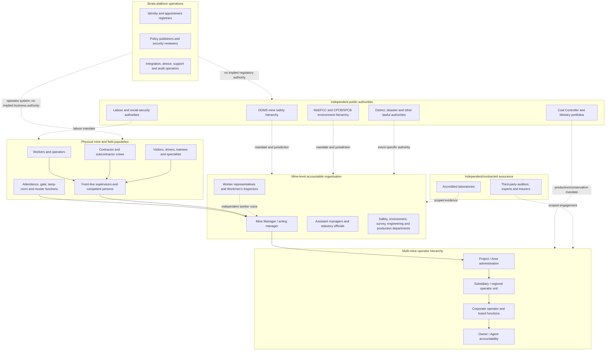
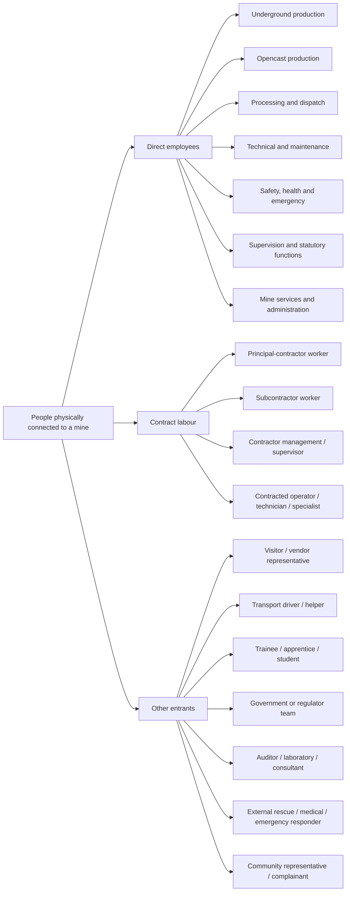
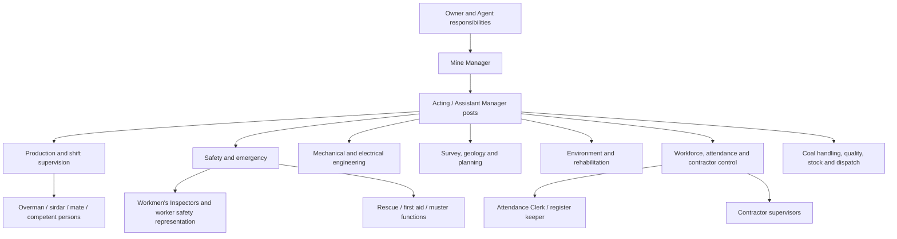
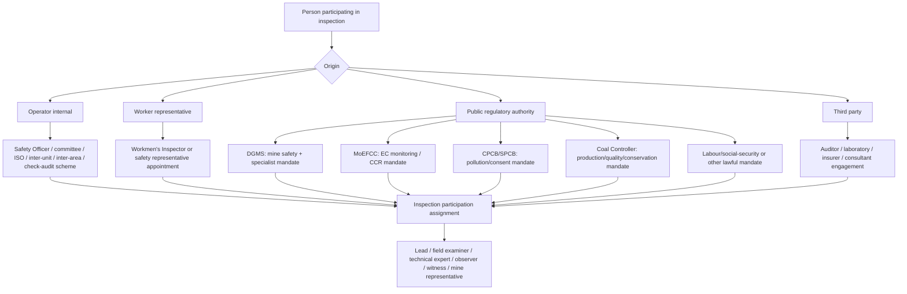
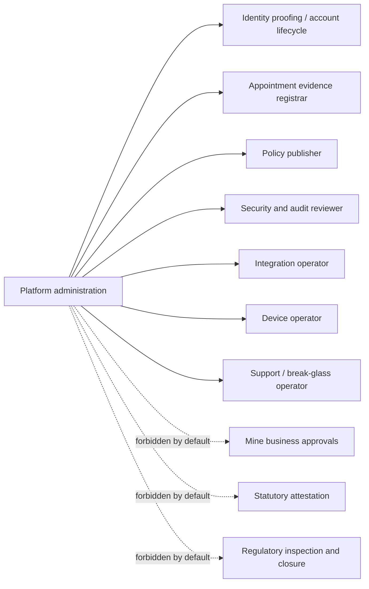

# Strata — Role and Scope Atlas

> **Status:** discovery and visualization artifact; not an authorization policy.
> **Read with:** [Identity and Authority Model](../architecture/identity-authority-model.md)
> [ReBAC Role, Resource and Document Graph](../architecture/rebac-role-resource-graph.md)
> and [Role Model Gap Register](role-model-gap-register.md).
> **Rule:** catalogues may grow; permissions never come from a role label alone.

## 1. Why a giant role enum will fail

There is no truthful list ordered from “lowest worker” to “super admin.” Three different
structures coexist:

1. an operator accountability hierarchy;
2. independent external authorities with limited mandates and jurisdictions; and
3. platform administrators who operate software but have no automatic mining authority.

A Mine Manager can control mine operations while being unable to close a DGMS finding.
A DGMS officer can inspect within a jurisdiction while being unable to approve payroll.
A platform administrator can recover a connector while being forbidden to attest either
record. Authority is a graph, not a ladder.

## 2. Whole ecosystem visualization



The dotted links are deliberately not management reporting lines.

## 3. Scope ladder: from one worker to national portfolio

| Scope level | Example resource | Typical posts/functions | What authority does **not** automatically expand to |
|---|---|---|---|
| Person | One worker/entrant | Self-service subject, assisted reporter | Other workers |
| Crew/task | One contractor crew, machine team or work package | Crew supervisor, competent person, task owner | Entire shift or mine |
| Section/zone | One face, pit, workshop, plant, magazine, outlet or environmental station | Section/shift official, overman/sirdar, plant supervisor, Attendance Clerk at outlet | Other zones |
| Shift | One mine operational shift | Official in charge, attendance custodian, control-room/muster function | Other shifts or historical periods |
| Mine | One opencast/underground/mixed mine | Mine Manager, assistant managers, Safety Officer, survey/engineering/environment/production posts | Other mines |
| Project/Area | Group of mines/assets under an operator unit | Area GM/project head, area safety/environment/personnel/finance/contract functions | Subsidiary-wide authority |
| Subsidiary/operator region | Many areas/mines | CMD/functional directors, internal safety organisation, regional functions | Another operator/tenant |
| Corporate operator | Entire operator portfolio | Board/corporate technical, safety, compliance, audit and enterprise functions | Public regulator powers |
| Public-authority unit | DGMS region, MoEFCC RO, SPCB regional office, CCO field office | Current officers under that unit | Other authority mandates or out-of-jurisdiction mines |
| Ministry/national portfolio | Explicit approved cross-operator set | Ministry portfolio and national programme posts | Unrestricted record access or mine operations |
| Platform | Strata service and control plane | Security, identity, policy, integration and support administration | Mine, employer, Ministry or regulator decisions |

Every scope is effective-dated. “Above” means broader organizational responsibility only
where an appointment/policy says so; it is not universal permission inheritance.

## 4. Field population atlas

These are configurable reference-data candidates, not login roles. A person can appear in
more than one branch and many people need no Strata account.



### 4.1 Underground work kinds

| Family | Illustrative work kinds to catalogue | Important qualification/scope dimensions |
|---|---|---|
| Winning/extraction | continuous-miner crew, longwall crew, coal cutter/operator, loader, development worker | Panel/face, method, machine competence, shift |
| Drilling/blasting | drill operator, shotfirer/blaster, explosive carrier/helper | Certificate/authorization, magazine/face, explosive rules |
| Strata support | roof bolter, support worker, depillaring/stowing worker | Support plan, district/panel, competent supervision |
| Transport/haulage | haulage operator, locomotive driver, tub handler, conveyor attendant, LHD/SDL operator | Route/equipment authorization, signal rules |
| Shaft/incline | winding engineman, banksman, onsetter, signal person | Installation/shaft, certificate and duty shift |
| Ventilation/drainage | ventilation worker, fan attendant, gas tester, pump operator | District, instrument calibration, competency |
| Electrical/mechanical | electrician, electrical supervisor, fitter, mechanic, welder | Installation/equipment class and isolation authority |
| Survey/geology | survey assistant, geological sampler | Survey assignment, plan/version and location |

### 4.2 Opencast work kinds

| Family | Illustrative work kinds to catalogue | Important qualification/scope dimensions |
|---|---|---|
| Excavation/loading | shovel/excavator, dragline, surface miner and loader operators | Machine class, bench/pit, authorization |
| Drilling/blasting | drill operator, blaster/shotfirer, explosive crew | Blast area, certificate, clearance duty |
| Haulage | dumper/tipper driver, dozer, grader and water-tanker operators | Vehicle class, route, traffic plan |
| Dump/bench safety | dump supervisor, spotter/signaller, slope-monitoring technician | Dump/bench, shift, monitoring instrument |
| Crushing/handling | crusher, feeder, conveyor, CHP and silo operators | Plant/line, isolation and start authority |
| Workshop/fuel | mechanic, electrician, tyre handler, welder, fuel/lubrication attendant | Workshop/bay, energy isolation, equipment |
| Survey/quality | survey crew, sampler, weighbridge and grade-control staff | Location, method, calibration and chain of custody |
| Dispatch | railway siding, road dispatch, weighment and documentation staff | Dispatch point, consignment and approval boundary |

### 4.3 Common mine services

| Domain | Illustrative functions |
|---|---|
| Attendance/access | Attendance Clerk, register keeper, gate/checkpoint operator, lamp-room attendant, roster validator |
| Safety/emergency | Safety Officer/team, first aider, rescue-trained worker, rescue-room/control-room/muster operator, fire team |
| Health/welfare | medical officer, nurse/paramedic, occupational-health staff, sanitation and welfare staff |
| Environment | sampling/monitoring technician, environment officer/team, reclamation/plantation crew, water/dust/noise operators |
| Security | security officer/guard, escort, access-control operator |
| Stores/material | storekeeper, magazine staff, material issuer/receiver |
| Civil/infrastructure | civil maintenance, road/drainage, lighting and utility crews |
| Administration | personnel/HR, training, contract, finance, procurement, legal, grievance, records and IT support |

“Worker” is the relationship to work. “Work kind” describes what they do. “Qualification”
proves eligibility. “Assignment” binds them to this mine/zone/shift. None is a permission
by itself.

## 5. Mine-level post atlas



This diagram is a discovery map, not a universal reporting chart. Exact post names,
required certificates, single/multi-holder rules and applicability differ by instrument,
mine profile and local organisation. Store them as effective-dated templates and concrete
posts, never source-code enums.

## 6. Multi-mine operator atlas

| Layer | Governance functions that may exist | Resource selector |
|---|---|---|
| Mine/project | manager, safety, production, environment, survey, engineering, personnel, contract, medical, dispatch | Exact mine/assets |
| Area/group | Area GM/project head, area safety, operations, environment, personnel, contracts, finance, rescue coordination | Governed mine set |
| Subsidiary | CMD/functional directors, Internal Safety Organisation, environment, production, vigilance, audit, HR, legal, procurement, IT | Subsidiary organisation unit and its assets |
| Operator corporate | Board, corporate safety/technical/compliance, enterprise audit, sustainability, risk, data governance | Explicit operator portfolio |

Do not force every operator into CIL's subsidiary/area structure. Recursive organisation
units plus explicit `asset_responsibility` support CIL, SCCL and private/captive operators.

## 7. Inspector and assurance classification



For any regulated participant, the UI and audit record should answer:

```text
Which person?
Which authority and authority unit?
Which concrete post and appointment instrument?
Which specialist discipline/mandate?
Which mine/geography/case and effective interval?
Which job in this inspection?
Which exact action are they trying to perform?
```

If any answer is absent, deny the protected action. Never display only “Inspector.”

## 8. Ministry, regulator and national views

External authorities sit beside the operator hierarchy, not above it as universal admins:

| Authority family | Illustrative governed scope | Example actions requiring separate mandates |
|---|---|---|
| DGMS | Zone/region, mine set, discipline, case | Inspect, enquire, issue mine-safety finding, verify/close under policy |
| MoEFCC Regional Office | Project/EC proposal and regional assignment | Process CCR, site visit, review/approve/e-sign through its workflow |
| CPCB/SPCB | State/region, consent/project, environmental medium | Inspect/sample, issue direction/consent action under applicable authority |
| Coal Controller Organisation | Field-office/portfolio and statutory function | Quality, production/statistics, conservation or permission activity |
| Labour/social security | Establishment/worker/contract-labour jurisdiction | Inspect labour records or administer scheme-specific work |
| Ministry of Coal | Explicit policy/monitoring portfolio | View governed aggregate/published state; no automatic DGMS or operator act |

An authority name grants nothing. Unit, appointment, mandate, jurisdiction, purpose,
target and time must intersect.

## 9. Platform administration is not “supermost admin”



Use dual control for high-risk administration. The appointment registrar verifies evidence
but does not appoint themselves; the policy publisher cannot approve their own change;
support access is time-bound, purpose-bound and reviewed. There is no universal
`SUPER_ADMIN` with unrestricted domain authority.

## 10. Canonical modelling recipe

For each catalogue entry or discovered real-world title:

1. classify it as affiliation, position template, concrete post, qualification, mandate,
   jurisdiction, duty assignment, participation role or persona;
2. identify the organisation or authority that owns it;
3. identify its resource scope and effective interval;
4. list capabilities as verbs on canonical resources;
5. identify appointment/assignment evidence and who validates it;
6. define performer, supervisor, final accountable owner and independent verifier;
7. define absence, acting charge, conflict, transfer and revocation;
8. map read projections separately from mutation authority; and
9. add negative tests proving what it cannot do.

### Example: one DGMS field examiner

```text
person: P-42
affiliation: DGMS officer
post: DDMS (Mining), Dhanbad Region 2
appointment: instrument A, valid [t1, t2)
mandate: mine-safety inspection + specified capabilities
jurisdiction: governed mine set for the region, valid [t3, t4)
inspection assignment: technical member on inspection I-9
participation job: FIELD_EXAMINER
requested action: record observation at Mine M
decision: intersection of every relationship above at action time
```

Changing the participation job to `LEAD` does not change the person's DGMS mandate.
Changing the selected workspace does not change jurisdiction.

## 11. Catalogue coverage checklist

The role discovery is complete for a deployment only when its catalogue accounts for:

- every person expected on site, including people without accounts;
- every direct employer, contractor and subcontractor relationship;
- every mine, outlet, shift, section, asset and work-package duty assignment;
- every statutory/operating post and qualification used at that mine profile;
- every worker-representation and internal-assurance scheme;
- every external authority/unit/mandate/jurisdiction that can interact with the mine;
- every mine-to-area-to-operator responsibility path actually used by that operator;
- every terminal action: receive, acknowledge, attest, approve, issue, verify, close,
  reopen, supersede and appeal;
- every vacancy, relief, additional-charge and conflict route; and
- every platform role plus mechanically tested forbidden business actions.

This is how Strata supports “all possible roles” without pretending one static list can be
complete forever: an extensible catalogue, concrete appointments and assignments, and a
mandatory coverage test per mine/operator/authority onboarding.
