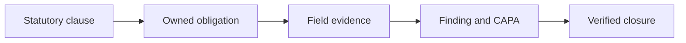
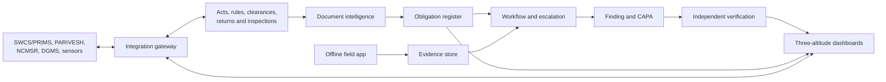
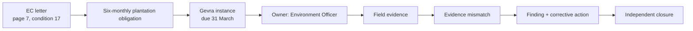
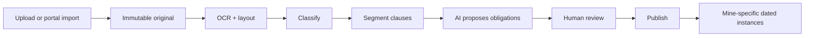
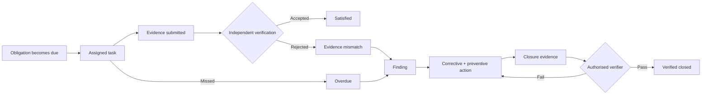
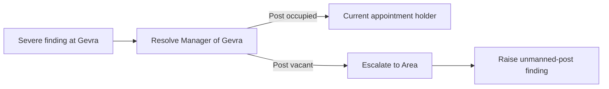
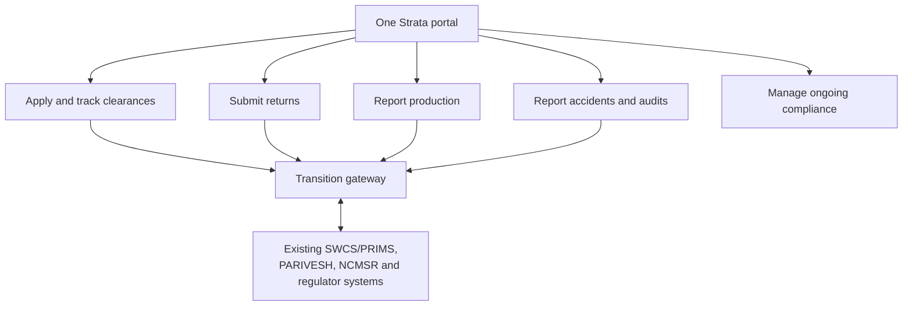

# Strata — Master PPT Source

**Problem Statement:** PS 26024 — AI-Based Smart Governance and Compliance Monitoring System for Coal Mines  
**Problem owner:** Ministry of Coal  
**Working product name:** Strata  
**Recommended main deck:** 15 slides plus appendix

---

## Slide 1 — Title

### On slide

**STRATA**  
**From statutory clause to verified closure**

One unified AI-enabled governance and compliance portal for every coal mine, subsidiary, field team and authorised regulator.

PS 26024 · Ministry of Coal

### Say

“Coal mining already produces enormous amounts of data. The failure is that a legal condition in one portal, a field observation on paper, a corrective action in a spreadsheet and a report sent upward are not connected. Strata connects that entire chain and makes every conclusion traceable.”

### Visual

---

## Slide 2 — The problem is fragmentation, latency and trust

### On slide

Today, governance records are split across:

- statutory portals and PDF clearances;
- paper inspections and registers;
- departmental spreadsheets;
- field photographs with weak provenance;
- disconnected accident, production and contractor systems; and
- delayed reports compiled manually.

### Consequences

| Fragmentation causes | Operational result |
|---|---|
| Same fact entered repeatedly | Conflicting values |
| Paper-to-office reporting delay | Decisions on stale information |
| Deadline tracked by individuals | Silent compliance gaps |
| Closure by status change | Fixes without proof |
| Different mine formats | No trustworthy portfolio comparison |

### Say

“This is not primarily a form-digitisation problem. It is a latency and verifiability problem: how fast does a field fact reach the right authority, and can that authority trust it?”

---

## Slide 3 — What the PS requires

### On slide

The expected solution calls for one digital ecosystem covering:

1. Central dashboards for mine, corporate and regulatory authorities
2. AI/analytics for risks, anomalies and recurring violations
3. Geo-tagged, offline mobile field reporting
4. Alerts, reminders, escalation, digital approvals and statutory reports
5. GIS, OCR digitisation and secure audit trails

Strata also provides a unified entry point for applications, returns, production reporting, accident/audit reporting and ongoing compliance work.

### Say

“We did not select only the convenient AI sentence. The product architecture maps directly to all five expected-solution bullets.”

---

## Slide 4 — The solution in one picture

### On slide

**Single control loop:** source → obligation → action → evidence → verification → governance.

---

## Slide 5 — The key innovation: clause-to-closure traceability

### On slide

At every step Strata preserves:

- source clause and page;
- accountable appointment;
- due rule and state history;
- evidence hashes and provenance;
- approvals and authority; and
- exact records behind dashboard values.

### Novelty claim

**Existing portals digitise transactions. Strata governs the lifecycle between those transactions.**

---

## Slide 6 — How a document becomes work

### On slide

AI proposes:

- required action;
- responsible post;
- applicability;
- frequency and deadline;
- required evidence; and
- source provenance.

**No AI-extracted legal duty becomes live without human confirmation.**

---

## Slide 7 — One lifecycle, no silent disappearance

### On slide

### Hard controls

- no obligation without an accountable post;
- no silent overdue state;
- no finding without a cited requirement;
- no closure without evidence;
- no self-verification; and
- no operator self-closure of regulator-raised findings.

---

## Slide 8 — Field evidence that can be trusted

### On slide

The Android app captures offline:

- inspection observations, incidents and task evidence;
- asset, location, accuracy radius and provider;
- direct-camera hash and capture metadata;
- device and time-confidence signals; and
- a persistent sync queue.

Four honest verdicts:

| Verdict | Meaning | Closure consequence |
|---|---|---|
| Verified | Strong location/device/time support | Can support closure |
| Plausible | Minor uncertainty, no contradiction | Can support; noted |
| Unverified | Cannot confirm or deny | Needs corroboration |
| Suspect | Active contradiction | Blocks closure |

### Demo moment

“Evidence claims to show a repaired bench but was captured 640 metres away. Strata preserves it, flags the mismatch and blocks closure.”

---

## Slide 9 — The right fact reaches the right authority

### On slide

**Rules address posts, not names.**

Delivery strategy:

- in-app is the auditable source;
- push for immediate field/mine alerts;
- SMS fallback for severe alerts;
- email for management, regulator views and digests;
- minor events are digested; severe events require acknowledgement.

Escalation adds visibility; it never removes ownership.

---

## Slide 10 — Dashboards at three altitudes

### On slide

| Altitude | Question answered | Landing view |
|---|---|---|
| Field/supervisor | What must I do next? | Due today, overdue on me, pending sync |
| Mine/area | What needs intervention? | Severe findings, overdue CAPAs, approvals, evidence gaps |
| Ministry/corporate/regulator | Where should we look first, and why? | Comparable risk, recurrence, trend and coverage |

Every number exposes:

- numerator and denominator;
- scope and period;
- freshness and offline gaps;
- metric definition; and
- source records.

**Unknown never becomes zero. Submitted never masquerades as verified.**

---

## Slide 11 — Where AI sits, honestly

### On slide

| Capability | Prototype | Human boundary |
|---|---|---|
| Document classification | AI-assisted | Uploader confirms |
| Clause/obligation extraction | LLM + structured output | Reviewer publishes |
| Evidence matching | Candidate suggestions | Verifier decides sufficiency |
| Duplicate observation detection | Similarity candidates | Human merges/splits |
| Recurrence | Deterministic + similarity | Explainable links |
| Risk score | Transparent rules | Decision support only |
| Operational anomaly | One labelled synthetic demonstration | Review signal, not accusation |
| Explanations/translation | Grounded generation | Cannot create compliance facts |

### Why anomaly detection?

The PS explicitly requires operational anomalies. Strata correlates production, dispatch, stock, attendance and environmental series to surface contradictions or unusual patterns. Production deployment waits for sufficient clean history.

---

## Slide 12 — Unified portal and phased supersession

### On slide

**Target:** one Strata experience for applications, clearances, statutory returns, production, accidents/audits and operational compliance.

Migration:

1. Unified front door over existing systems
2. Shared identity, mine master and common data model
3. Move workflows into Strata where Ministry authority permits
4. Retire duplicated SWCS functions only after parity, migration and approval

### Say

“Supersession is a destination, not a big-bang deployment claim.”

---

## Slide 13 — Feasibility: deep prototype, scalable design

### On slide

**Prototype:** one mine deep, two mines shallow.

Deep mine demonstrates:

- real public source document;
- AI extraction and human review;
- obligation and dated instance;
- field observation, evidence mismatch and CAPA;
- appointment-aware approval;
- dashboard drill-down and audit history.

Two shallow mines demonstrate:

- multi-mine comparison;
- scope isolation;
- recurrence/risk ranking; and
- Ministry-level aggregation.

Simulated but labelled:

- external portal feeds;
- one operational anomaly;
- SMS/email transport if credentials are unavailable.

---

## Slide 14 — Impact and measurable success

### On slide

| Outcome | Pilot measure |
|---|---|
| Faster visibility | Capture-to-responsible-post latency |
| Fewer missed obligations | Overdue instances per 100 due instances |
| Stronger closure | Percentage of closures with acceptable evidence |
| Less manual reporting | Fields reused versus manually re-entered |
| Better accountability | Severe alerts acknowledged within SLA |
| Earlier intervention | Recurrences detected before next scheduled audit |
| Faster onboarding | Mine configured without code changes |

National scale:

- all coal operators and subsidiaries;
- tenant-isolated deployment;
- common obligation/evidence vocabulary; and
- authorised Ministry and regulator portfolio views.

---

## Slide 15 — Why Strata wins

### On slide

1. **Complete answer to the PS** — portal, AI, mobile, workflows, dashboards, GIS-ready evidence and audit
2. **Not another dashboard** — every number drills to evidence and source law
3. **Honest AI** — proposes and explains; humans retain legal authority
4. **Field reality first** — offline, multilingual and uncertainty-aware
5. **Governance by construction** — expiring appointments and separation of duties
6. **Feasible prototype, credible production path** — deep vertical slice plus phased migration

### Close

> Strata ensures that a compliance failure becomes visible to the right authority before it becomes an incident—and that neither the failure nor its history can quietly disappear.

---

# Appendix slides

## A1 — Product modules

- Unified applications and submissions
- Mine/asset and appointment directory
- Document intelligence
- Obligation register
- Inspections, defects, findings and CAPA
- Offline field application
- Evidence integrity
- Workflow, notification and approvals
- Three-altitude dashboards
- Risk, recurrence and anomaly analytics
- GIS/spatial view
- Reports and integrations
- Append-only audit/time travel

## A2 — User groups

- Ministry/platform administration
- Corporate/subsidiary management
- Area and mine officials
- Safety/environment/production/labour officers
- Field inspectors and supervisors
- Contractor administrators/supervisors
- External regulators and auditors
- Workers as record subjects, normally not application accounts

## A3 — Existing system relationship

| System | Existing focus | Strata target relationship |
|---|---|---|
| SWCS/PRIMS | Clearances, project and production workflows | Phased functional migration/supersession |
| PARIVESH | Statutory green clearances | Federated statutory integration |
| NCMSR | Accidents and safety audits | Integrate, then unify user journey where authorised |
| DGMS systems | Statutory safety regulation/enforcement | Integrate; authority remains with DGMS |
| Shram Suvidha | Labour compliance | Integrate; authority remains with Labour Ministry |
| Star Rating | Assessment framework | Align evidence, never impersonate rating |
| CPCB/SPCB/IoT | Environmental/sensor signals | Corroborating data and event triggers |

## A4 — Research and official references

- [PS 26024 internal verbatim source](../context/problem-statement.md)
- [Ministry of Coal — Single Window Clearance System](https://www.coal.gov.in/nominated-authority/single-window-system)
- [Ministry of Coal — NCMSR description](https://www.coal.nic.in/sites/default/files/2025-02/chap14AnnualReport2025en2.pdf)
- [Official PARIVESH portal](https://parivesh.nic.in/)
- [Official SIH evaluation guidance](https://sih.gov.in/letters/Guidelines-College-SPOC.pdf)
