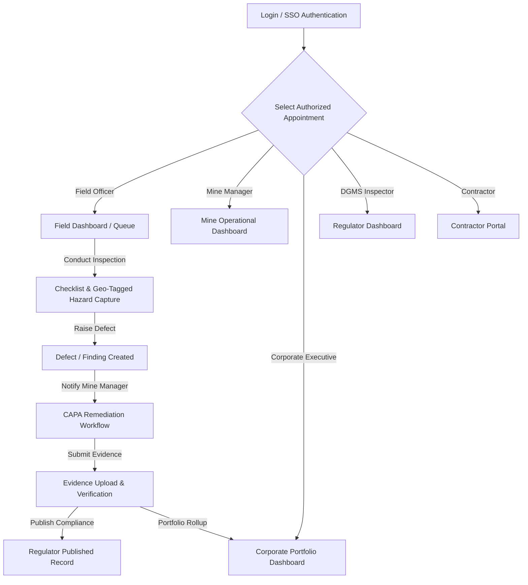

# Strata UI Design System & Comprehensive Role-by-Role Screen Catalog

> **Extracted directly from [strata-role-enduser-ui-kit.md](file:///c:/Users/DELL/Downloads/strata-master%20(2)/strata-master/docs/strata-role-enduser-ui-kit.md)**  
> **Target:** SIH 26024 — AI-Based Smart Governance & Compliance Monitoring System for Coal Mines (Ministry of Coal / CIL)

---

## 1. Global Shell & Core Layout Architecture

### 1.1 Universal Top Bar (Present across all roles)
- **Strata Wordmark**: Brand identity, direct home/dashboard navigation.
- **Mine / Scope Selector**: Scoped dynamically to authorised mine appointments via `GET /mines`. Switching scope updates all telemetry, dashboards, and registers in-place.
- **Period Selector**: Financial Year & Quarter selector (`FY 2026-27`, `Q1`, `Q2`, `Q3`, `Q4`) passing `period=` to list and stat endpoints.
- **Notification Bell & Live Counter**: `GET /notifications?filter[unacknowledged]=true` with counter badge and drawer trigger.
- **User Avatar & Session Dropdown**: Displays appointment, role avatar, profile settings, language picker, and logout.

### 1.2 Notification Drawer
- **Severity Classification**:
  - `SEVERE` (Red alert badge): Requires immediate acknowledgment (`POST /notifications/{id}/actions {action:"ACKNOWLEDGE"}`).
  - `SIGNIFICANT` (Amber alert badge): Approaching deadline / warning (e.g. Due in 14 days).
  - `INFO` (Blue badge): Routine assignments and update notices.
- **Bulk Action**: `[Mark all Read]` clearing unacknowledged badge state.

### 1.3 Persistent Authority Banner (Novelty Pillar 3: Governance-Aware Authorisation)
- Time-bounded appointment context shown persistently across Field and Mine Management roles:
  - **Normal State (Green/Slate)**: Active appointment within validity period.
  - **Warning State (Yellow)**: Inside 30 days of appointment expiry.
  - **Expired / Lockdown (Red)**: Expired appointment requiring re-gazetting / delegation renewal.
  - Displays: **Officer Name**, **Statutory Post Title**, **Mine Unit**, **Appointment Validity Range**, and link to `GET /appointments/{id}`.

---

## 2. Design System Components & UI Primitives

| Component | Visual Specification | Props / Data Interface |
|---|---|---|
| **StatCard** | Glassmorphic card, bold metric, altitude-aware | `title`, `value`, `trend`, `freshness` (`LIVE` / `DELAYED` / `OFFLINE_GAPS`), `numerator`, `denominator`, `formula` |
| **StatusBadge** | Color-coded pill with subtle border | `variant`: `critical`, `warning`, `success`, `info`, `neutral` |
| **DataTable** | High-density tabular layout with sorting & sticky headers | `columns`, `data`, `onRowClick`, `filters`, `pagination` |
| **GISMapWidget** | Geospatial viewer with layer switcher & hazard pins | `center`, `layers` (Leasehold, Haul Roads, Blast Danger Zone, Sensors), `markers` |
| **AuditTrail** | Immutable timeline with actor stamps & verification hashes | `entries`: Array of `{ id, action, actor, timestamp, hash }` |
| **ObservationRecorder** | Camera capture, voice note, GPS tag, severity toggle | Form with offline cache support (`localStorage` / IndexedDB fallback) |
| **EvidenceUploader** | Drag-and-drop document upload with MIME validation | Supports PDF, geo-tagged JPEG/PNG, signed XML registers |

---

## 3. Role-by-Role Screen Catalog & Wireframe Breakdown

### ROLE 1: FIELD-LEVEL USERS (5 Sub-Roles)

#### 1.1 Field / Mine Inspector
- **Route 1: Dashboard (`/field/dashboard`)**
  - *My Queue*: Overdue inspections, pending observations, draft violation notices.
  - *Stat Tiles*: 7-day completed shifts, open high-risk findings, pending evidence reviews.
  - *Quick Action*: `[+ Start Field Inspection]`, `[Record Hazard Observation]`.
- **Route 2: Inspections List (`/field/inspections`)**
  - Search & filter by shift, seam, pit location, status (`SCHEDULED`, `IN_PROGRESS`, `COMPLETED`).
- **Route 3: Inspection Detail (`/field/inspections/[id]`)**
  - Step-by-step statutory checklist (Ventilation, Strata Control, Machinery Safety, Explosives handling).
  - Digital sign-off with timestamp and GPS coordinates.
- **Route 4: Record Observation (`/field/inspections/[id]/observe`)**
  - Fast-entry hazard log: Photo attachment, severity (`CRITICAL`, `HIGH`, `MEDIUM`, `LOW`), statutory rule violated (e.g. *CMR 2017 Reg 104*).
- **Route 5: Finding & Defect List (`/field/findings`)**
  - Unified defect register, status pills (`OPEN`, `UNDER_REPAIR`, `VERIFIED_CLOSED`).
- **Route 6: Finding Detail (`/field/findings/[id]`)**
  - Root cause analysis, assigned mine engineer, target resolution date, CAPA reference.
- **Route 7: Obligations Queue (`/field/obligations`)**
  - Daily/weekly statutory routines (e.g. daily air sampling, methane testing log).
- **Route 8: Evidence Submission (`/field/obligations/[id]/submit`)**
  - Form IV/V submission, gas testing certificates, calibration certificates.
- **Route 9: Documents (`/field/documents`)**
  - Standard Operating Procedures (SOPs), safety standing orders, emergency manuals.

#### 1.2 Safety Officer
- **Dashboard (`/field/dashboard`)**: Methane/CO gas sensor alarms, dust exposure logs, Near-Miss ratio, PPE compliance rate.
- **Safety Documents (`/field/safety/documents`)**: DGMS safety circulars, safety committee minutes, rescue room equipment fitness logs.

#### 1.3 Environmental Officer
- **Dashboard (`/field/environment`)**: Ambient Air Quality Index (PM10, PM2.5, SOx, NOx), Effluent Treatment Plant (ETP) pH/TDS levels, Overburden dump plantation survival rate.
- **Documents (`/field/environment/documents`)**: Consent to Operate (CTO), Environmental Clearance (EC) letters, Half-yearly MoEFCC compliance reports.

#### 1.4 Labour / HR Officer
- **Attendance Dashboard (`/field/attendance`)**: Form B statutory muster roll, contractor vs departmental headcount, shift-wise gate attendance, PME/IME medical examination validity.
- **Grievances Portal (`/field/grievances`)**: Worker welfare complaints, wage delay tickets, anonymous reporting inbox.

#### 1.5 Engineer / Heavy Machinery Supervisor
- **Assets Dashboard (`/field/assets`)**: HEMM (Shovels, Dumpers, Draglines) daily fitness certificates, pressure vessel testing schedules, conveyor belt fire suppression checks.
- **Defect Findings (`/field/assets/findings`)**: Equipment breakdown tickets, maintenance work orders, safety lockout status.

---

### ROLE 2: MINE MANAGEMENT (Mine Manager, Safety Manager, Ops Manager)

- **Screen 1: Mine Manager Dashboard (`/mine/dashboard`)**
  - Real-time Site Compliance Health Score (0-100%).
  - Breakdown of active statutory appointments, critical safety stop-work notices, production vs EC ceiling.
- **Screen 2: Compliance Matrix (`/mine/compliance`)**
  - Interactive radar of 5 statutory pillars: DGMS Safety, MoEFCC Environment, SPCB Pollution, IBM Mining Plan, PESO Explosives.
- **Screen 3: Staff & Statutory Appointments (`/mine/staff`)**
  - Mines Act 1952 statutory roster: Manager, Safety Officer, Ventilation Officer, Overmen, Mining Sirdars, Blasting Officers with authorization certificate numbers & expiry dates.
- **Screen 4: CAPA Management (`/mine/capas`)**
  - Corrective & Preventive Action ledger with Kanban stages: `PROPOSED` -> `ASSIGNED` -> `EVIDENCE_UPLOADED` -> `VERIFIED_CLOSED`.
- **Screen 5: Contractor Oversight (`/mine/contractors`)**
  - Contractor safety induction records, valid CLRA licenses, EPF/ESIC compliance verification.
- **Screen 6: Inspections Oversight (`/mine/inspections`)**
  - Comprehensive inspection calendar, surprise DGMS visit log, internal audit reports.
- **Screen 7: Obligations Registry (`/mine/obligations`)**
  - Site-specific statutory lease conditions, renewal deadlines, recurring compliance filings.
- **Screen 8: Documents & Returns Archive (`/mine/documents`)**
  - Form I annual returns, monthly statistical returns, explosive consumption records.
- **Screen 9: Mine Map & Hazardous Zones (`/mine/map`)**
  - GIS layer overlays: Mine boundary, blasting radius (500m danger zone), dump slopes, water monitoring stations.
- **Screen 10: Site Grievances (`/mine/grievances`)**
  - Local village & community grievance log, contractor labour dispute escalations.
- **Screen 11: Mine Settings & Parameters (`/mine/settings`)**
  - Threshold alert configurations (e.g. methane % cutoff), shift timings, escalation notification matrix.
- **Screen 12: Production & Dispatch Filings (`/mine/production`)**
  - Daily extraction (ROM) vs Annual EC Cap, weighbridge reconciliation, coal stockyard balance.

---

### ROLE 3: CORPORATE MANAGEMENT (CIL / Subsidiary Executives & Compliance Board)

- **Screen 1: Executive Portfolio Dashboard (`/corporate/dashboard`)**
  - Multi-subsidiary risk heatmap (ECL, BCCL, CCL, NCDC, SECL, WCL, MCL, NEC).
  - Corporate Risk Index, Total Active Violations, Production vs Compliance correlation.
- **Screen 2: Predictive Analytics & AI Insights (`/corporate/analytics`)**
  - Machine learning risk forecasting: Recurring incident patterns, seasonal hazard spikes (e.g. monsoon slope instability).
- **Screen 3: Regulatory Litigation & Cases (`/corporate/regulatory-cases`)**
  - Show-cause notices, High Court / NGT litigation dockets, potential penalty liabilities.
- **Screen 4: Document Intelligence & Regulation Library (`/corporate/documents`)**
  - LLM-powered parser extracting compliance clauses from 100+ page EC / FC letters automatically into obligations.
- **Screen 5: Compliance Portfolio Drilldown (`/corporate/compliance`)**
  - Mine-by-mine comparative ranking, non-compliance recurrence rate, executive intervention alerts.
- **Screen 6: Enterprise Inspections Registry (`/corporate/inspections`)**
  - Cross-subsidiary inspection outcomes, DGMS inquiry reports, independent safety audit scores.
- **Screen 7: Findings Registry (`/corporate/findings`)**
  - Systemic violation tracking, cross-mine recurring defects (e.g. haul road berm height deficiencies).
- **Screen 8: Executive Reports & BRSR Filings (`/corporate/reports`)**
  - One-click Board Pack generator, ESG (BRSR Core) reporting disclosures, Parliament question briefing dossiers.
- **Screen 9: Contractor Governance (`/corporate/contractors`)**
  - Vendor pre-qualification ratings, corporate blacklists, safety performance scoring across all tenders.
- **Screen 10: Obligations Master Registry (`/corporate/obligations`)**
  - Master repository of all statutory obligations under Indian mining jurisprudence.
- **Screen 11: Administration & RBAC (`/corporate/admin`)**
  - Enterprise user access provisioning, appointment governance, immutable system audit logs.

---

### ROLE 4: REGULATORY USERS (DGMS & MoEFCC / SPCB Regional Inspectors)

- **Screen 1: Jurisdictional Regulator Dashboard (`/regulatory/dashboard`)**
  - Overview of mines within regional jurisdiction (e.g. Dhanbad / Bilaspur / Ranchi Circles).
  - Priority inspection target list generated by algorithmic risk scoring.
- **Screen 2: Conduct Inspection (`/regulatory/inspections/[id]/conduct`)**
  - Regulatory enforcement interface: Record contraventions, serve Section 22(1) / 22(1A) prohibition orders.
- **Screen 3: Issue Regulatory Finding / Notice (`/regulatory/findings/raise`)**
  - Digital issuance of Form IV Improvement Notices, immediate electronic dispatch to Mine Manager & Agent.
- **Screen 4: Regulatory Cases & Prosecution Dockets (`/regulatory/cases`)**
  - Case file management: Evidentiary documentation, prosecution sanction records, court hearing dates.
- **Screen 5: Scheduled Inspections (`/regulatory/inspections`)**
  - Statutory inspection calendar, surprise check schedules, joint inter-departmental audits.
- **Screen 6: Findings Issued Registry (`/regulatory/findings`)**
  - Complete history of notices served, compliance verification status, penalty compounding status.
- **Screen 7: Obligation Register (Published Projection) (`/regulatory/obligations`)**
  - View published compliance evidence from mine operators with redactions for worker privacy.
- **Screen 8: Jurisdiction Map (`/regulatory/map`)**
  - Regional GIS map showing cluster-wide violation density, mine lease borders, and sensitive environmental zones.
- **Screen 9: Statutory Instruments & Orders (`/regulatory/instruments`)**
  - Gazette notifications, DGMS (Tech) Circulars, standing guidelines, standard inspection protocols.

---

### ROLE 5: CONTRACTOR PORTAL (Self-Service Partner Workspace)

- **Screen 1: Contractor Partner Dashboard (`/contractor/dashboard`)**
  - Active work packages, contractor safety rating score, pending gate passes, compliance checklist status.
- **Screen 2: Work Packages & Scopes (`/contractor/packages`)**
  - Assigned contracts (e.g. OB removal, coal transport, drilling), SLA metrics, active heavy equipment deployed.
- **Screen 3: Workers Register (`/contractor/workers`)**
  - Contract worker roster with IME/PME medical clearance status, VTC training certificates, gate pass RFID cards.
- **Screen 4: Contractor Compliance Register (`/contractor/compliance`)**
  - CLRA Form VI license renewals, EPF / ESIC monthly challan proof, statutory minimum wage payment registers.
- **Screen 5: Contractor Document Vault (`/contractor/documents`)**
  - Insurance policies, vehicle fitness certificates, driver licenses, indemnities.
- **Screen 6: Worker Grievances (`/contractor/grievances`)**
  - Grievance resolution channel for contract labourers (wages, safety equipment, camp amenities).

---

## 4. Key Interactive Flows & Data Contracts

## 5. UI Color Tokens & Aesthetics

- **Dark Mode Surface**: `#020617` (Slate-950), Cards: `#0f172a` (Slate-900), Borders: `#1e293b` (Slate-800)
- **Role Accents**:
  - **Field**: Amber-500 (`#f59e0b`) — High visibility, rugged, industrial.
  - **Mine Management**: Emerald-500 (`#10b981`) — Operational health, stability.
  - **Corporate**: Blue-500 (`#3b82f6`) — Enterprise executive clarity.
  - **Regulatory**: Purple-500 (`#a855f7`) — Statutory authority, formal jurisdiction.
  - **Contractor**: Orange-500 (`#f97316`) — External partner, service vendor.
- **Severity Tokens**:
  - **Critical / Prohibition (DGMS Sec 22)**: Crimson (`#ef4444`)
  - **High / Show-Cause**: Amber (`#f59e0b`)
  - **Medium / Improvement Notice**: Yellow (`#eab308`)
  - **Low / Advisory**: Sky (`#0ea5e9`)
